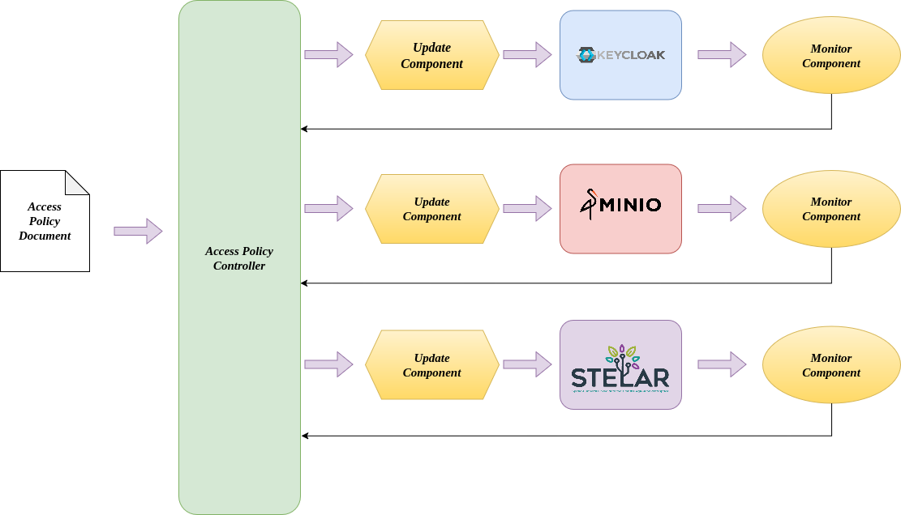
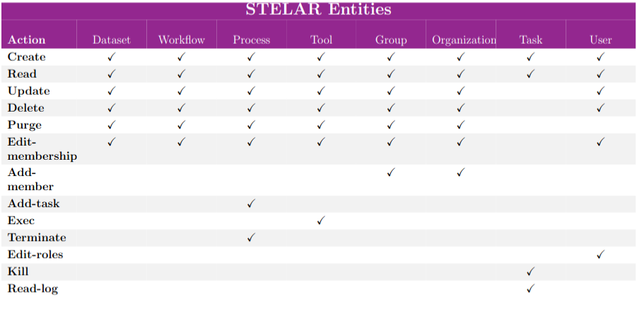
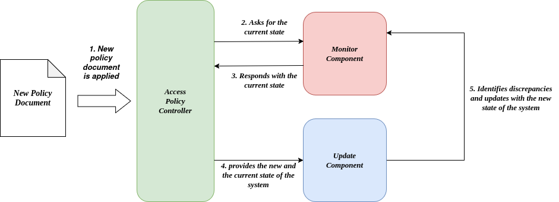

The STELAR KLMS authorization scheme
========================================
STELAR KLMS authorization scheme is based on RBAC (Role-Based Access Control). Users are assigned to roles either directly or through group
memberships. Each role is associated with a set of permissions that defines what actions has the role to perform on the platform's resources.
This RBAC model can be expressed using a declarative YAML-based specification language, that allows administrators to define custom policies documents, 
including the roles and their associated permissions, with a structured and human-readable format. 

These custom policy documents are used as input to the STELAR KLMS Policy Management System, which is responsible to process the defined policies and
translate them into service-specific authorization rules. The system is also responsible to evaluate access requests against the defined policies
and update the the current authorization state of the system if a new policy document is applied, through a process called policy reconciliation.

In this way the STELAR KLMS authorization scheme provides a flexible and extensible way to manage access control in the platform, allowing administrators
to define custom policies that fit their specific needs and requirements.

Policy Management System Architecture
-----------------------------------------
The STELAR KLMS Policy Management System is composed of several components that work in conjuction to support
all the lifecycle of the authorization policies, from their definition and management to their evaluation and enforcement.
An architecture diagram of the Policy Management System is shown below:

.. raw:: html

   

The main components of the Policy Management System are:

- **Access Policy Document**: This is the input of the system. In this document, the administrator of the system describes the high-level authorization intents, including roles, resources, and actions, using the YAML-based policy description language.
- **Access Policy Controller**: The core of the system, responsible for parsing the policy document and generating the necessary configurations for the underlying systems. Additionally, this is where the policy evaluation takes place. Every time a user tries to access a resource, the controller evaluates the policy document to determine whether the access should be granted or denied.
- **Monitor Component**: Monitor component is responsible to keep track the current applied policies for each service. This component works in conjuction with the update component to ensure that the policies are up-to-date and consistent across all services.
- **Update Component**: This is the component that is responsible for updating the policies if a change is detected in the policy document. It ensures that the policies are always in sync with the current state of the system.

YAML-based Policy Description Language
------------------------------------------
The language provides specific fields designed to support the definition of fine-grained
access control policies. The general structure of the language is as follows:

.. code-block:: yaml

   roles:
     - name: 
       permissions:
         - action: 
           resource:

The core component of the policy specification is the **roles** field, where the roles to be
created are defined. Multiple roles can be declared, each consisting of a name and a set
of **permissions**. Permissions are expressed as pairs of **action** and **resource**, indicating
what operations a role is allowed to perform and on which group of resources. The
structure supports various action and resource specifications, enabling administrators
to define access rules that align with the authorization mechanisms required by each
individual STELAR component.

Actions and Alises
^^^^^^^^^^^^^^^^^^^^^^^^^^^^^^^^^^^^^^^^^^^^^^^^^^^
In addition to role and permission definitions, the language supports the use of the **actions** field, which allows administrators to define aliases for individual actions or action
groups. These aliases act as descriptive identifiers for commonly used operations and can
represent either a single action or a collection of related actions. A general structure for defining actions is as follows:

.. code-block:: yaml

   actions:
     - alias_name: ["action1", "action2", ...]

An usage example of the actions field is presented below:

.. code-block:: yaml

   actions:
     - readAll: ["read_Dataset", "read_Workflow", "read_Process"]

   roles:
    - name: "Data Scientist"
      permissions:
        - action: "readAll"
          resource:
            ...

Permissions in STELAR KLMS
-------------------------------------------
In STELAR KLMS, we distinguish two major types of permissions, each tailored to a distinct component of the platform:

- **Data Catalog/STELAR Permissions**
- **Data Permissions**

Each of these permission types supports a specific set of actions and resource specification schemes and are expressed in the policy document
utilizing their respective YAML-based syntax. The following sections provide an overview of the permissions available for each type.

.. note::
    STELAR adopts a **default-deny** (also known as implicit deny) access control model.
    Under this approach, access to a resource is granted only if an explicit permission is
    assigned. If a permission is not defined for a role, access to the corresponding resource
    is automatically denied—there is no need to declare explicit denial rules.

Data Catalog/STELAR Permissions
^^^^^^^^^^^^^^^^^^^^^^^^^^^^^^^^^^^^^^^^^^^^^^^^^^^
These permissions govern access to the data catalog (e.g., datasets) and STELAR-native
entities such as processes and tasks. They are expressed using the **"action-resourceSpec"** pair and their general YAML syntax is as follows:

.. code-block:: yaml

   permissions:
       - action: 
         resourceSpec:
            ...

Actions
^^^^^^^^^^^^^^^^^^^^^^^^^^^^^^^^^^^^^^^^^^^^^^^^^^
A detailed table that enumerates the actions available for the Data Catalog/STELAR permissions is provided below:

.. note::
    In catalog/stelar permissions, actions are entity-specific—for example, **read-Dataset** and **read-Workflow**. While both
    actions represent a read operation, they apply to different resource types. In addition
    to the standard CRUD operations, actions that apply only on specific entities are also supported (e.g **kill_Task**, **exec_Tool**)

Resource Specification
^^^^^^^^^^^^^^^^^^^^^^^^^^^^^^^^^^^^^^^^^^^^^^^^^^
Each permission includes a resource specification, which identifies the exact set of re-
sources on which the defined actions can be applied. For catalog-related permissions,
STELAR supports four types of resource specifications, which leverage the grouping and organizational models described to support flexible, fine-grained access control.

Attribute Resource Specification
^^^^^^^^^^^^^^^^^^^^^^^^^^^^^^^^^^^^^^^^^^^^^^^^^^^
This specification targets resources based on metadata attributes. For instance, datasets
include attributes such as name, creation date, and identifier. Attribute-based filtering
allows for defining access conditions such as “datasets created on 2023-10-01.”
The structure of this specification ise represented below:

.. code-block:: yaml

   permissions:
        - action: 
          resourceSpec:
            - attr: 
              operation: 
              value:

Where:

- **attr**: Specifies the resource attribute used for constructing the access rule, such as the name, creation date, or description of the resource.
- **operation**: Indicates the operation to evaluate the relationship between the attribute and its value. Operations can be:
    - **equals**: Checks if the attribute matches the specified value.
    - **like**: Checks if the attribute matches a pattern (e.g., using wildcards).
- **value**: Represents the specific value the resource attribute must meet or match.

An example of a permission using the attribute resource specification is shown below:

.. code-block:: yaml

   permissions:
       - action: "update_Dataset"
         resourceSpec:
           - attr: "creation_date"
             operation: "equals"
             value: "2023-10-01"

Group Membership Resource Specification
^^^^^^^^^^^^^^^^^^^^^^^^^^^^^^^^^^^^^^^^^^^^^^^^^^^
This specification identifies resources based on their association with a specific group, as
well as their type and functional role (capacity) within that group. It's basic structure is as follows:

.. code-block:: yaml

   permissions:
       - action: 
         resourceSpec:
           - type: 
             group: 
             capacity: 

Where:

- **type**: Indicates the type of resource, such as Dataset, Workflow, Process, Tool, Group, Organization, Task, or User.
- **group**: Specifies the group to which the resources must belong.
- **capacity**: Distinguishes resources within the specified group based on their unique characteristics or roles.

An example of a permission using the group membership resource specification is shown below:

.. code-block:: yaml

   permissions:
       - action: "delete_Dataset"
         resourceSpec:
           - type: "Dataset"
             group: "STELAR"
             capacity: "mainDataset"

Organization Membership Resource Specification
^^^^^^^^^^^^^^^^^^^^^^^^^^^^^^^^^^^^^^^^^^^^^^^^^^^
Similar to group-based specifications, this type filters resources by their organizational
context, including resource type and capacity. Its basic structure is as follows:

.. code-block:: yaml

   permissions:
       - action: 
         resourceSpec:
           - type: 
             org: 
             capacity: 

Where:

- **type**: Indicates the type of resource, such as Dataset, Workflow, Process, Tool, Group, Organization, Task, or User.
- **org**: Specifies the organization to which the resources must belong.
- **capacity**: Distinguishes resources within the specified organization based on their unique characteristics or roles.

An example of a permission using the organization membership resource specification is shown below:

.. code-block:: yaml

   permissions:
       - action: "update_Workflow"
         resourceSpec:
           - type: "Workflow"
             org: "STELAR"
             capacity: "mainWorkflow"

User Membership Resource Specification
^^^^^^^^^^^^^^^^^^^^^^^^^^^^^^^^^^^^^^^^^^^^^^^^^^^
This specification defines access based on a user's membership within a group or organi-
zation and the user's specific capacity. Below is presented the general structure of this
specification both for organization and group membership.

.. code-block:: yaml

   permissions:
       - action: 
         resourceSpec:
           - group/org: 
             capacity: 

Where:

- **group/org**: Specifies the group or organization to which the user must belong.
- **capacity**: Indicates the user's role or capacity within the specified group or organization.

An example of a permission using the user membership resource specification is shown below:

.. code-block:: yaml

   permissions:
       - action: "read_User"
         resourceSpec:
           - org: "STELAR"
             capacity: "admin"

Data Permissions
^^^^^^^^^^^^^^^^^^^^^^^^^^^^^^^^^^^^^^^^^^^^^^^^^^^^
This type of permission governs access to resources stored in the platform's storage layer.
Specifically, it allows for the definition of access rules based on actions and resource targets
within MinIO, the system's underlying object storage. Permissions expressed in YAML
are automatically translated into corresponding S3-compatible policies which are then assigned to user roles. 
An example of how such permissions are represented in YAML format is shown below:

.. code-block:: yaml

   permissions:
       - action: 
         resource: 

Actions
^^^^^^^^^^^^^^^^^^^^^^^^^^^^^^^^^^^^^^^^^^^^^^^^^^
Actions in storage-layer permissions are based on the S3-compatible API exposed by
MinIO. As such, STELAR leverages the same set of operations defined by AWS S3 poli-
cies. These include actions such as **s3:GetObject**, **s3:PutObject**, and **s3:DeleteObject**,
which correspond to read, write, and delete operations on objects stored in MinIO buckets.

.. note::
    To enhance usability and reduce verbosity in policy definitions, administrators can
    take advantage of the action aliases feature. These aliases map to one or more low-level
    S3 operations. For example:

    .. code-block:: yaml
        
        actions:
            - read: ["s3:GetObject"]
            - write: ["s3:PutObject"]
            - delete: ["s3:DeleteObject"]
            - list: ["s3:ListBucket"]
    
    A full list of supported S3 actions can be found in the MinIO documentation: https://min.io/docs/minio/linux/administration/identity-access-management/policy-based-access-control.html#id5

An example of data type permission using the action aliases is shown below:

.. code-block:: yaml

   actions:
       - read: ["s3:GetObject"]
       - write: ["s3:PutObject"]
       - delete: ["s3:DeleteObject"]

   roles:
     - name: "Data-Manager"
       permissions:
          - action: "read"
            resource: "my-bucket/*"
          - action: "write"
            resource: "my-bucket/my-object-1.txt"
          - action: "delete"
            resource: "my-bucket/my-object-2.txt"

Policy Reconciliation
-------------------------------------------
In STELAR KLMS the access policy is dynamic and can be updated to adapt to evolving
requirements of the data lake and its applications. To facilitate this, STELAR employs
a reconciliation-based approach through the Access Policy Controller. This controller
continuously monitors the actual access configurations of each STELAR component, it
compares them against the desired configurations specified by the current Access Policy
Model and afterwards implements necessary updates to achieve consistency and fidelity.
Each component in the STELAR ecosystem features its own dedicated driver, consisting
of a Monitor and an Update component instance. When the Access Policy Model is up-
dated through a new Policy Document, the Access Policy Controller triggers an evaluation
process, retrieves the current configuration for each component, identifies discrepancies,
and applies the required conversions. These updates, might include invalidating existing
JWT tokens, removing outdated permissions, and introducing new permissions to align
with the updated policy. 

.. raw:: html

   

