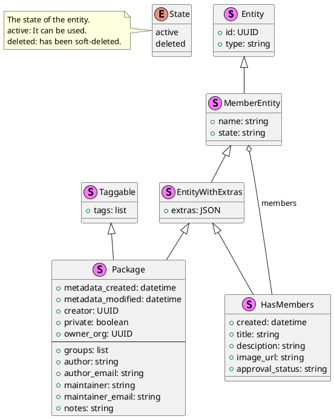
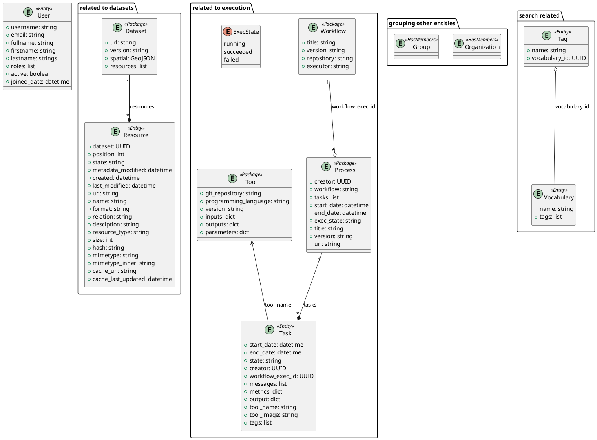
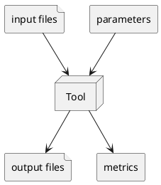
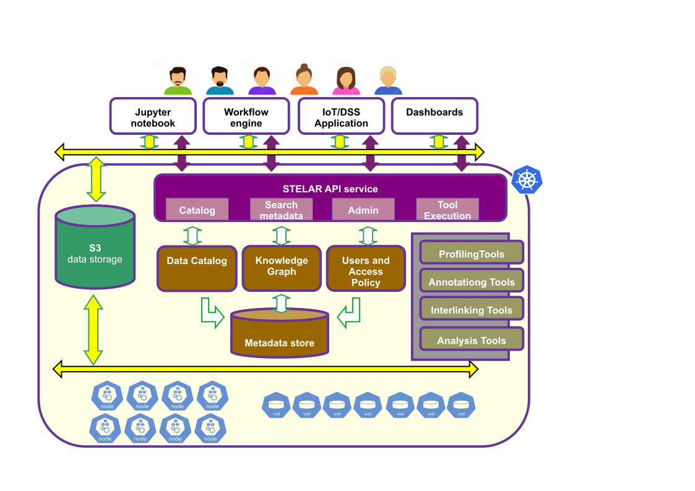

**********************************
An Overview of the STELAR KLMS
**********************************

In order to descibe the functions of the client, we will first provide an overview of the STELAR KLMS.
The STELAR KLMS is a system that provides a unified interface for managing and accessing data, tools, and workflows.
It is designed to support the entire data lifecycle, from data ingestion and storage to analysis and visualization.
The STELAR KLMS is built on a microservices architecture, which allows for flexibility and scalability.
It is designed to support a wide range of use cases, including data science, machine learning, and artificial intelligence.

If we were to describe the main functions of the STELAR KLMS, we would say that it is a system for:

1. **Storing and managing data**, mainly in the form of files (images, tabular data, etc.) 
#. **Applying data analysis tools**, via which data is transformed and analyzed. Tools are executed as **tasks** or **workflow processes**. Workflows are defined as a series of tasks that can be executed in parallel or sequentially (e.g., data processing, machine learning, etc.).
#. **Collecting and managing metadata** pertaining to the datasets, tasks and processes in the system. Metadata is automatically collected and searchable in several ways, including spatial search and ad-hoc SparQL queries.


Our overview will examine the STELAR KLMS from three perspectives:

1. The concepts that underpin the STELAR KLMS in its three main functions.
2. The architecture of the STELAR KLMS, including the microservices that implement the functions.
3. The STELAR authorization scheme, which controls access to the system and its operations.

Important parts of the STELAR KLMS that are not covered fully in this document include:

- The STELAR Knowledge Graph, which is a graph-based representation of the data and metadata in the system.
- The STELAR deployment framework, which is a set of tools and libraries for deploying and managing the STELAR KLMS in a cloud environment.
- The STELAR tools, a suite of sophisticated data analysis tools that are available in the STELAR KLMS. Each of these tools is quite sophisticated and has its own documentation.
- The STELAR extensibility guidelines, which allow users to extend the functionality of the STELAR KLMS by adding custom tools and extension APIs.

All of the above topics are covered in various STELAR project documents, which is available at `the STELAR site <https://stelar-project.eu>`_.


.. note:: The STELAR KLMS is a complex system, and this overview is intended to provide a high-level understanding of its components and functions. For more detailed information, please refer to the STELAR documentation and the STELAR project site.

.. note:: The STELAR KLMS is a complex system, and this overview is intended to provide a high-level understanding of its components and functions. For more detailed information, please refer to the STELAR documentation and the STELAR project site.


The Main Concepts of the STELAR KLMS
========================================

Working with STELAR, the main function that you will be performing is to manage data and metadata.
As far as data is concerned, the STELAR data lake provides access to its data via the Amazon S3 API.
The data is stored in a distributed file system, which allows for high availability and scalability.

Concepts of the S3 Data Store
-------------------------------

For an in-depth desciption of the S3 data store, please refer to the `Amazon S3 documentation <https://docs.aws.amazon.com/AmazonS3/latest/userguide/Welcome.html>`_. In addition, the Minio documentation provides a good overview of the S3 API and its features. The Minio documentation is available at `the Minio site <https://docs.min.io/docs/minio-overview.html>`_.


The data is organized into **buckets**, which are similar to *volumes* (or partitions) in a file system.
The creation and configuration of buckets is done by the STELAR system administrator.
Then, client applications can access the buckets and their contents via some S3 SDK.

The data is stored in **objects**, which can be like of any type (e.g., images, tabular data, etc.).
From the point of view of the system, an object is a binary large object (BLOB) that is stored in a bucket.
The size of an object can be from a few bytes up to 5 TB, and the maximum number of objects in a bucket is unlimited
(although the total size of all objects in a bucket is limited by the size of the bucket).
Objects are identified by a unique key, which is a combination of the bucket name and the object name.

There is no proper folder structure in the S3 data store. However, the object names can be split into
parts using the slash (/) character, which can be used to create a pseudo-folder structure.

Objects are accessed via a URL, which is a combination of the bucket name and the object name.
Suppose that we have a bucket named ``mybucket`` and an object named ``myfolder/myfile.txt``.
To access the object name we would combine the bucket name and the object name into URL, as follows:
```
s3://mybucket/myfolder/myfile.txt
```

There is a special category of objects called **directory objects**. These are objects of size 0 bytes, whose name ends in a slash (/).
Directory objects are used to create a pseudo-folder structure in the S3 data store.


STELAR entities
----------------------------

Outside of the S3 data store, the STELAR KLMS comprises a number of entities that are used to represent data, metadata, users, execution tasks, etc. All entities share some common characteristics, and are managed via the STELAR API, a ReSTful API implemented over http.
The entities in the STELAR KLMS can be categorized into the following groups:

- Entities to describe data and metadata:
  - **Datasets**, which describe collections of data.
  - **Resources**, which are members of datasets and represent actual data files or metadata files.
  - **Tags**, which are labels attached to a dataset.
  - **Vocabularies** of tags, which create namespaces for tags.

- Entities to organize the whole catalog of Entities:
  - **Organizations**, which are top-level entities that are collections of other entities.
  - **Groups**, which are similar to organizations but are more suited for organizing ad-hoc collections of entities.

- **Users**, entities that represent the users of the STELAR KLMS.

- Entities related to the execution of tasks and processes:
  - **Tasks**, which are the execution of a tool on datasets.
  - **Processes**, which are the execution of a workflow (a series of tasks).
  - **Workflows**, which represent metadata about processes. Each process may be related to a workflow entity.
  - **Tools**, which represent the data analysis tools available in the STELAR KLMS.


All of these entities are stored in a *Knowledge Graph (KG)* and can be searched using SPARQL queries.

Entity fields
^^^^^^^^^^^^^^^^^^

Entities can be thought as JSON objects, and each has a number of fields, depending on its type.
Some fields are common to all entities, while others are specific to the type of entity.
Some fields are set and maintained by the STELAR KLMS, while others are set and maintained by the user.
The fields set and maintained by the system are marked as (system), which means that they are read-only and 
cannot be modified by the user. 
Fields may be updatable, while others are **immutable** (cannot be changed after they are created).
Also, some fields are **mandatory** (cannot be null), while others are optional (can be null).

Finally, some types of entities support **extras**, which are custom fields set by the user.

The fields common to all entities are:

id (system)
    The unique identifier of the entity. This is a UUID (Universally Unique Identifier) that is generated 
    by the STELAR KLMS when the entity is created. The UUID is a 128-bit integer that is used to identify 
    the entity in the system.

type (system)
    The type of the entity. This is a string that indicates the type of the entity, such as "dataset", 
    "resource", "user", etc.


Entity stereotypes
^^^^^^^^^^^^^^^^^^^^^^^^

Several entities have common parts and characteristics. We can represent these common parts as 
*stereotypes*. The stereotypes are represented as a "class hierarchy" in a UML class diagram,
where the subclasses *inherit* the fields of their superclasses. 

For example, the ``Package`` stereotype is a sub-class of the ``EntityWithExtras`` stereotype, meaning
that those entities which are Packages, all have an "extras" field, inherited from ``EntityWithExtras``.




Entities
^^^^^^^^^^^^^^^^^^^^^^

The entities of STELAR are shown below. They are labeled by their most specific stereotype. The attributes shown
in the diagram below are attributes *in addition* to those inherited from the entity stereotype.



The entities can be classified according to their use:

- Entities related to datasets:
  
  - Dataset
  - Resource
  
- Entities related to search:
  
  - Tag
  - Vocabulary 

- Entities related to grouping:

  - Organization
  - Group

- Entities related to execution:

  - Task
  - Process
  - Workflow
  - Tool

- Entities related to the system:

  - User


Datasets
----------

The main metadata entities in the STELAR KLMS are **datasets** and **resources**. They are both types of **entities** of the STELAR Data Catalog.

A **dataset** is a collection of data. A dataset can be a single object or a collection of objects that are related to each other.
Note that the data in a dataset need not be stored in the STELAR data lake. It can be stored in any other data store, such as a relational database or a NoSQL database, or even to be provided by a service online.

A dataset has several fields, which include the following:

name (immutable)
    The name of the dataset. The name is a string containing only alphanumeric characters, underscores (_), and hyphens (-).
    The name must be unique within the STELAR KLMS and cannot be changed after the dataset is created.
    The name can be used to identify the dataset in the system (similar to the dataset id) but is human-readable.

state (system)
    Whether the dataset entity is `active` or `deleted`. STELAR supports "soft delete" semantics, where a deleted dataset
    is not actually removed from the system, but instead its state is set to `deleted`. This allows for easy recovery of deleted datasets.
    If it is desired to actually remove a dataset, the delete operation must be designated as a **purge**.


metadata_created (system)
    The date and time when the dataset was created. This field is set by the STELAR KLMS when the dataset is created.
    The date and time is in ISO 8601 format (YYYY-MM-DDTHH:MM:SSZ).

metadata_modified (system)
    The date and time when the dataset was last modified. This field is set by the STELAR KLMS when the dataset is modified.
    The date and time is in ISO 8601 format (YYYY-MM-DDTHH:MM:SSZ).

creator (system)
    The creator of the dataset. This field is a UUID that describes the creator of the dataset and is used to identify it in the system.

private (mandatory)
    A boolean field that indicates whether the dataset is private or public. This field is used to control access to the dataset.
    More details will be provided in the section on the STELAR authorization scheme.

owner_org (mandatory)
    The organization that owns the dataset. This field is a UUID that identifies the organization which owns the dataset.

groups
    The groups this dataset is a member of.


Apart from the above fields, a dataset entity has many fields that describe the actual dataset.
These fields are:

title
    The title of the dataset. This is a string that describes the dataset and is used to identify it in the system.

author:
    The author of the dataset. 
author_email
    The email of the author of the dataset.

maintainer
    The maintainer of the dataset.

maintainer_email
    The email of the maintainer of the dataset.

notes
    A string containing free-text information about this dataset.

tags
    The tags of the dataset. This is a list of strings that label the dataset.

url
    The URL of the dataset. If not null, this is a string that describes the location of the dataset and is used to access it in the system.

version
    The version of the dataset. This is a string that describes the version of the dataset and is used to identify it in the system.

spatial
    The spatial extent of the dataset. This field, if not null, must be a GeoJSON object that describes the spatial extent of the dataset.

resources (system)
    The list of resources that are part of the dataset. Resources are described in the next section.

extras
    This attribute takes as its value a JSON object that contains user-defined fields. 
    The name of a user-defined field should be a valid python name (although this is not enforced). 
    The value of a user-defined field can be any JSON object.

Resources
----------

A dataset may contain a list of **resources**, which represent actual data files that are part of the dataset, or metadata files that describe 
the dataset. One such prominent metadata file is the **profile** of the dataset, which is a file that contains metadata about the dataset itself. The profile is a JSON file whose format depends on the type of the dataset (i.e., whether the data is tabular, image, etc.). The profile is used to describe the dataset and its contents, and it is used by the STELAR KLMS to generate metadata about the dataset.
Each resource contains some standard fields, which include the following:

dataset (system)
    The dataset that this resource is part of. This field is a UUID that identifies the dataset in the system.
    The dataset is the parent of the resource.

position (system)
    An integer specifying the rank of the resource in the dataset's resource list. 
    This field is managed by the STELAR KLMS and cannot be set directly by the user.

state (system)
    The state of the resource. This field is managed by the STELAR KLMS and cannot be set directly by the user.
    The state can be `active` or `deleted`. STELAR supports "soft delete" semantics, where a deleted resource
    is not actually removed from the system, but instead its state is set to `deleted`. This allows for easy recovery of deleted resources.
    If it is desired to actually remove a resource, the delete operation must be designated as a **purge**.

created (system)
    The date and time when the resource was created. This field is set by the STELAR KLMS when the resource is created.
    The date and time is in ISO 8601 format (YYYY-MM-DDTHH:MM:SSZ).

metadata_modified (system)
    The date and time when the resource was last modified. This field is set by the STELAR KLMS when the resource is modified.
    The date and time is in ISO 8601 format (YYYY-MM-DDTHH:MM:SSZ).

Also, the resource entity has many fields that describe the actual resource.
These fields are:

name
    The name of the resource. Unlike the dataset name, the resource name is not unique in the system, or even
    within the dataset, and it can be null.

url
    The URL of the resource. This is a string that describes the location of the resource and is used to access it in the system.
    If the URL scheme is `s3`, the URL designates an object stored in the STELAR data lake.

format
    The format of the resource. This is a string that describes the data format of the resource and is used to identify it in the
    system. The format can be `csv`, `json`, `excel`, `xml`, `png`, `parquet` etc.

relation
    The relation of the resource to the dataset. This is a string that describes the relation of the resource to the dataset
    and is used to identify it in the system. The relation can be `owned` or `profile`.

resource_type
    The type of the resource.

description
    A string containing free-text information about this resource.

size
    The size of the resource. This is an integer that describes the size of the resource in bytes.

hash
    A string that somehow represents a hash value for the contents of the resource. Nominally, when this value
    changes, it indicates that the contents of the resource have changed. It is custom to use the SHA-256 hash algorithm to compute this value.
    However, this is not enforced by the STELAR KLMS, and the user can set this value to any string.

last_modified
    The date and time when the data of this resource was last modified. This field is maintained by the user, not by
    the STELAR KLMS. The date and time is in ISO 8601 format (YYYY-MM-DDTHH:MM:SSZ).

mimetype
    The MIME type of the resource. This is a string that describes the MIME type of the resource and is used to identify it in the system.
    The MIME type can be `text/csv`, `application/json`, `application/vnd.ms-excel`, `image/png`, `application/x-parquet` etc.

cache_url
    A url designating a cached copy of the resource. The caching is user-defined and is not managed by the STELAR KLMS.

cache_last_updated
    The date and time when the cache was last updated. This field is maintained by the user, not by the STELAR KLMS.
    The date and time is in ISO 8601 format (YYYY-MM-DDTHH:MM:SSZ).    


Organizations and groups
----------------------------

Organizations and groups are used to organize other types of entities in the STELAR KLMS.
They both follow the ``<<HasMembers>>`` stereotype, which means that they can have as members
any entity of the ``<<MemberEntity>>`` stereotype.

These two types of entities are very similar, as they support the same attributes. The 
only difference is that organizations are "top-level" entities that *partition* datasets 
(and some other types of entitites). 


Organizations are meant to represent collections of datasets, processes and workflows that
are somehow semantically related. Also, organization membership can be used provide
authorization to users for certain operations (more on this issue will be provided in the
section on the STELAR authorization scheme).

One use case for organizations is to implement data lake **zones**, which are used to separate
data in the data lake into different areas. For example, a data lake may have a **raw zone**
where data is ingested, a **clean zone** where data is cleaned and transformed,
and a **analysis zone** where data is used for analysis and reporting. In general, zones
partition datasets depending on the data lifecycle stage they are in.
Another use case for organizations is to implement **data governance** policies, which are used to
control access to data and ensure that data is used in a compliant manner. For example, an organization may have a policy that requires
data to be encrypted at rest and in transit, or that requires data to be anonymized before it is shared with third parties.
Another use case for organizations is to implement **data stewardship** policies, which are used to ensure that data is
managed in a consistent and compliant manner. For example, an organization may have a policy that requires data to be
classified according to its sensitivity level, or that requires data to be retained for a certain period of time.
Groups are used to organize other types of entities in the STELAR KLMS. Groups are similar to organizations, but they are not top-level entities and do not partition datasets. Groups are used to organize users and other entities in the system, and they can be used to control access to data and tools.

Groups can be used to implement **data sharing** policies, which are used to control access to data and ensure that data is shared in a compliant manner. For example, a group may have a policy that requires data to be updated only by certain user roles, or that requires 
data to be shared only for certain purposes. 

Groups can also be used to implement **dataset cataloging**, where datasets organized in the same group can be related as to
their contents, or some application-specific criteria.

MemberEntity: Members of organizations and groups
^^^^^^^^^^^^^^^^^^^^^^^^^^^^^^^^^^^^^^^^^^^^^^^^^^^

The entities associated with an organization or group are called its **members**. The following entities can be members of an organization or group:

- datasets
- processes
- workflows
- tools
- users  (users can belong to multiple organizations and groups)
- groups (groups can be members of other groups)
- organizations (organizations are rarely members of a group or organization, but they can be)

Each member of a group has joined the group under a specific **capacity**. Capacities are strings whose semantics are user-defined.
The STELAR KLMS will add members to a group or organization with a specific capacity, but it will not enforce any semantics on the capacity.


Packages
------------------

The ``<<Package>>`` stereotype is used to represent a collection of entities that have some important common characteristics.

Searchability
    All packages can be searched in a very flexible manner. STELAR supports the Apache Solr search engine, which allows for
    full-text search, faceted search, and spatial search. The search engine is used to index the entities in the STELAR KLMS and
    provide a unified search interface for all entities. 

They support tags
    Tags are labels assigned to packages, that allow for easy classification and labeling. They can be used as search targets

Owner organization
    Every package in the STELAR KLMS is **owned** by an organization, as defined the attribute ``owner_org``.
    The owner organization is typically used to control access to the entity.
    The owner organization is set when the entity is created, but it can be changed later 
    (although this should be rare).


Entities related to execution
---------------------------------

One of the important features in the STELAR KLMS is the ability to execute data analysis tools on datasets,
and record the metadata about the execution. The execution and metadata mechanism is implemented by four entities.

Tools and Tasks 
^^^^^^^^^^^^^^^^^^^^^^^^^^^^^^^^^^^^^^^^^^^^


The smallest unit of execution is a **task**, which is the execution of a **tool** on one or more datasets. 
A **tool** can be thought of as a data analysis program which takes as input data files and **parameters** and
produces as output data files and **metrics**.



When a new task is created the user must provide the following information:

- The tool to be executed.
- The files to be used as input. These can be datasets or resources, or plain files stored in the STELAR data lake.
- The parameters to be used in the execution. These are the parameters that are passed to the tool when it is executed.
- The datasets or resources that will be created or updated, to hold the output files generated by the tool.

All of the above metadata is available via the task entity, after the task it is created. Once the task is
created, it is scheduled to be executed by the STELAR KLMS and its execution state is ``running``. 
The execution may be delayed because the task is queued for execution.
Also, the task may take a long time to terminate. However, the task will 
eventually succeed or fail, or be cancelled.

If the task succeeds, the output files are created and the task state is marked as `succeeded`.
Also, the task records a set of **metrics**, which are small-size results of the execution encoded
as a JSON object. Depending on the tool's nature, metrics can refer to the quality of the processing, the
size of the output result, or other relevant information about the execution.
At this point, the output files generated by the execution (and stored in the data lake) 
are published in the STELAR data catalog as was specified in the task creation.

If the task fails, the output files are not created and the task state is marked as `failed`.

Processes and Workflows
^^^^^^^^^^^^^^^^^^^^^^^^^^^^^^^^^^^^^^^^^^^^

Every task is part of a **process**, which is the execution of a **workflow**.

.. note::
    The terms **process** and **workflow** are often used interchangeably. 
    However, in the STELAR KLMS, a process is the execution of a workflow, 
    while a workflow is a metadata entity that describes a collection of related
    processes.


Processes in STELAR are purely metadata entities that relate tasks together, and are not in 
any way affecting execution. This allows the STELAR KLMS to record the execution of
"multi-step jobs" consisting of several
sequential or parallel tasks, regardless of the orchestration engine that is used to
sequence and/or parallelize these steps. As long as this orchestrator provides
the process id for each task it creates, the STELAR KLMS can record the metadata
correctly. 

Another role for processes is to assist in the management of tasks, by holding in the 
catalog intermediate results as ``resources``. While these resources may later be 
deleted from the STELAR KLMS, the lineage of data will be preserved as metadata in the
STELAR KLMS.


External tasks 
^^^^^^^^^^^^^^^^^^^^^^^^^^^^^^^^^^^^^^^^^^^^

When creating a new task, it is possible to avoid to specify a tool to be executed.
In this case, the task is an **external task**, which is a task that is executed 
by the user outside of the STELAR KLMS. There are several use cases for this feature:

1. The user wants to execute a tool that is not available in the STELAR KLMS, but is available in the user's environment.
2. The user wants to execute a tool that is available in the STELAR KLMS, but does not want to use the STELAR KLMS to execute it, for example because the tool is not compatible with the STELAR KLMS execution environment (e.g., lack of GPU support).
3. The user has already executed her work outside the KLMS at a prior time and now wants to record the metadata of this execution in the KLMS.

After creating an external task, the user is responsible for performing an additional step, which is to
invoke the STELAR API and provide the metadata of the execution output. This metadata includes the following:

- The terminal state of the task (`succeeded`` or `failed``).
- If `succedded`, 
  - The set of output files generated by the execution (and stored in the data lake).
  - The set of metrics generated by the execution (if any).


Process termination
^^^^^^^^^^^^^^^^^^^^^^^^^^^^^^^^^^^^^^^^^^^^

As STELAR does not manage the execution/orchestration of processes, it cannot know when a process is terminated.
However, the user can invoke the STELAR API to mark the process as terminated and provide the final execution state
for the whole process, either as `succeeded` or as `failed`. 

A precondition for marking a process as terminated is that all tasks in the process must be in a terminal state, i.e., either `succeeded` or `failed`. Once a process is terminated there is no way to change its state, nor can any new tasks be added to it.


Architecture of the STELAR KLMS
========================================

The STELAR KLMS is built on a microservices architecture, which allows for flexibility and scalability.
The platform on which STELAR runs is a Kubernetes cluster, which is a container orchestration platform that allows for the deployment and management of microservices.
The STELAR KLMS is composed of several microservices, each of which is responsible for a specific function.



Some important points in the architecture are:

The clients of STELAR (shown in white)
    The STELAR klms is designed to be used by several types of clients, which can be interactive (like a Jupyter notebook),
    batch-oriented (like a workflow engine or ML pipeline manager), or even on the background (the STELAR KLMS is used as 
    back-end for a decision-support software).

The STELAR API service (shown in purple)
    This is a service providing endpoints for all the STELAR KLMS functions. It is a ReSTful API that is implemented over http.
    The STELAR API service is the main entry point for all client applications that want to access the STELAR KLMS,
    regardless of whether the clients perform data ingestion, data analysis, metadata search, etc. 

The S3 data storage (STELAR data lake, shown in green)
    This is a distributed file system that is used to store the data and metadata in the STELAR KLMS.
    The STELAR data lake is built on top of the Minio object storage system, which is an open-source implementation of the Amazon S3 API.
    For performance, access is directly to the Minio object storage system, and not via the S3 API.
    However, this may lead to some inconsistencies in the metadata, if for example the user deletes an object in the Minio system
    without notifying the STELAR KLMS. The STELAR KLMS will not be able to detect this inconsistency immediately.

The KLMS services (shown in brown)
    These are the microservices that implement the functions of the STELAR KLMS. 
    They are not normally visible to the user, therefore we only discuss them briefly. The main components are:
    - The metadata database which is implemented by a PostgreSQL database with GIS extensions.
    - The Data Catalog service, which is implemented by the CKAN system. CKAN is an open-source data catalog system that provides a unified interface for managing and accessing data.
    - The Knowledge Graph service, which is implemented by the OnTop service.
    - The user management and authentication service, which is implemented by the Keycloak system. Keycloak is an open-source identity and access management system that provides a unified interface for managing users and authentication.
  
The STELAR tools (shown in gray)
    These tools are advanced data analysis tools that are available in the STELAR KLMS.
    They are mainly responsible for data profiling, data annotation, data interlinking and data transformation and analysis.
    Each of these tools is quite sophisticated and has its own documentation.

The Kubernetes cluster (shown in blue)
    Although not normally visible to the user, access to the Kubernetes cluster is often important in order to 
    administrer the STELAR KLMS. Since tasks are executed as Kubernetes Jobs, the cluster is also somewhat relevant
    to tool implementors, especially if they have advanced requirements for the execution environment of their tools.


Acessing the STELAR KLMS
------------------------------

The STELAR KLMS provides several APIs and GUIs for accessing its functions. These include:

  - The STELAR API, which is a ReSTful API that provides access to the STELAR KLMS and its functions.
    The STELAR API can be invoked either directly (via http) or via the STELAR client.
  - The STELAR web interface, which is a web-based GUI suitable for inspection and some basic operations.
  - The Minio-based S3 API, which provides access to the STELAR data lake and its contents.
    The S3 API can be invoked either directly (via http) or via the STELAR client. There are
    numerour S3 SDKs available for different programming languages, which can be used to access the STELAR data lake.
  - The Minio console interface, which is a web-based GUI suitable for inspection and some basic operations on the
    STELAR data lake.
  - For user management and Single Sign-On, the STELAR KLMS uses the Keycloak identity and access management system.
    Keycloak provides a web-based GUI for user management and Single Sign-On, and it is integrated with the STELAR KLMS.
  - For deployment, upgrade, and under-the-hood management of the STELAR KLMS, administrators and highly-trusted users
    can access the Kubernetes cluster via the Kubernetes API (or other relevant clients).
    

When a deployment of the STELAR KLMS is made, several DNS domain names are used in order to access the main parts of the
system. All these names belong to the same *base* DNS domain. This is known as the **DNS base** of the deployment.
In the following, we assume that the DNS base ``stelar.example.com``.

===============================================  ====================================================
URL                                              Component
===============================================  ====================================================
https://klms.stelar.example.com/stelar           The STELAR API service ``base_url``
-----------------------------------------------  ----------------------------------------------------  
https://klms.stelar.example.com/stelar/help      Returns a JSON object with hyperlinks.
-----------------------------------------------  ----------------------------------------------------  
https://klms.stelar.example.com/stelar/api       The STELAR API url
-----------------------------------------------  ----------------------------------------------------  
https://klms.stelar.example.com/stelar/docs      The STELAR API documentation
-----------------------------------------------  ----------------------------------------------------  
https://klms.stelar.example.com/stelar/console   The STELAR web interface
-----------------------------------------------  ----------------------------------------------------  
https://klms.stelar.example.com/s3               The Minio web console
-----------------------------------------------  ----------------------------------------------------  
https://minio.stelar.example.com/                The S3 minio API
-----------------------------------------------  ----------------------------------------------------  
https://kc.stelar.example.com/                   The Keycloak web interface
===============================================  ====================================================


The STELAR KLMS authorization scheme
========================================

blah